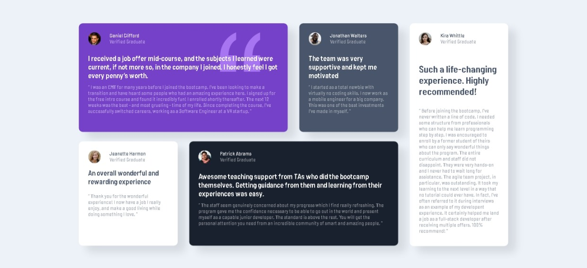

# Frontend Mentor - Testimonials grid section solution

This is a solution to the [Testimonials grid section challenge on Frontend Mentor](https://www.frontendmentor.io/challenges/testimonials-grid-section-Nnw6J7Un7). Frontend Mentor challenges help you improve your coding skills by building realistic projects. 

## Table of contents

- [Overview](#overview)
  - [The challenge](#the-challenge)
  - [Screenshot](#screenshot)
  - [Links](#links)
- [My process](#my-process)
  - [Built with](#built-with)
  - [What I learned](#what-i-learned)
  - [Continued development](#continued-development)
  - [Useful resources](#useful-resources)
- [Author](#author)
- [Acknowledgments](#acknowledgments)

## Overview

### The challenge

Users should be able to:

- View the optimal layout for the site depending on their device's screen size

### Screenshot

### Links

- Solution URL: [Solution Testimonial grid](https://github.com/Kaji17/Testimonials-Grid-Section-with-HTM-CSS-Flexbox-CSS-grid-)
- Live Site URL: [kaji17](https://kaji17.github.io/Testimonials-Grid-Section-with-HTM-CSS-Flexbox-CSS-grid-/)

## My process

### Built with

- Semantic HTML5 markup
- CSS custom properties
- Flexbox
- CSS Grid
- Mobile-first workflow

### What I learned

I learned how to build grid-like layouts with a combination of flexbox and CSS grid

### Continued development

UI intend to complete my skills in front-end development, which is why I will continue my learning with the use of js in my projects and also the use of a SASS preprocessor and the Bootrasp framework

### Useful resources

- [resource 1](https://www.youtube.com/watch?v=LNqBKTeeiWo&t=1332s) - This is an amazing tuto which helped me finally understand flexbox. I'd recommend it to anyone still learning this concept
- [resource 2](https://youtu.be/2H602-zG62w) - This is an amazing tuto which helped me finally understand CSS grid. I'd recommend it to anyone still learning this concept.

## Author

- Github - [Ouattara Katina](https://github.com/Kaji17)
- Frontend Mentor - [@Kaji17](https://www.frontendmentor.io/profile/Kaji17)
- Twitter - [@pevirgile](https://www.twitter.com/pevirgile)

## Acknowledgments